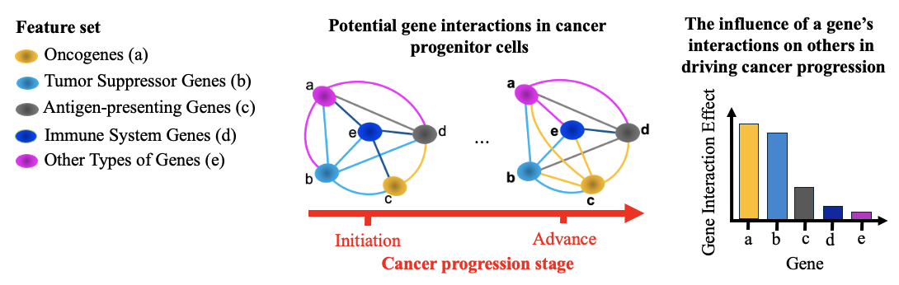
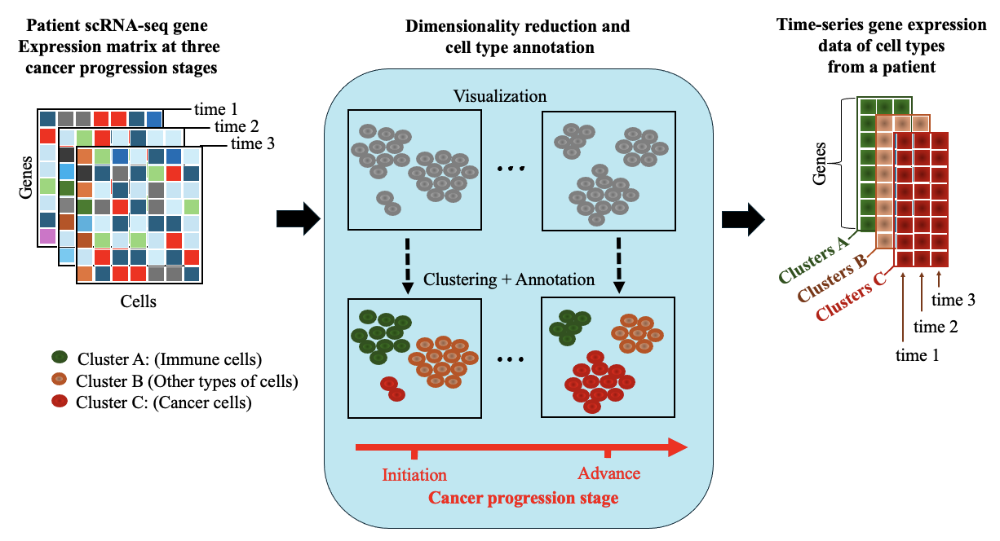
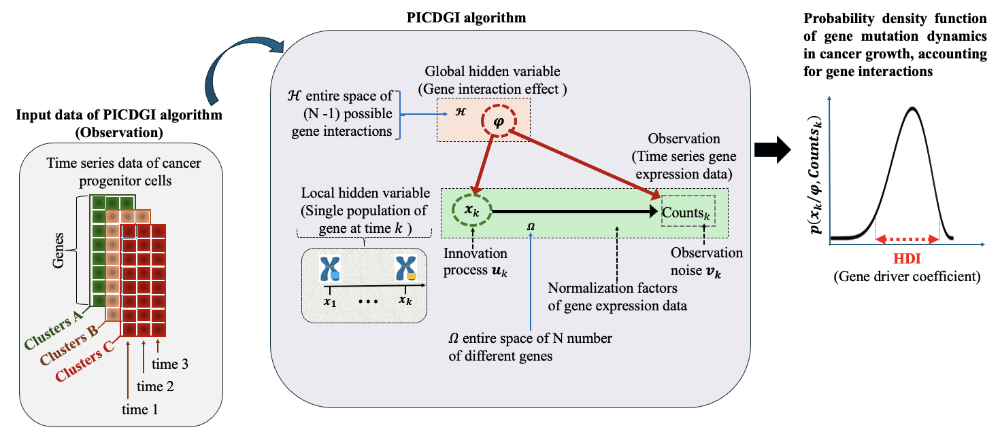

# PICDGI: Predict Immunosuppressive Cancer Driver Gene using gene-gene Interaction feature

$~~$

**Traditional frequency-based methods identify driver mutations by evaluating their recurrence across tumors, operating under the assumption that mutations occurring more frequently are functionally significant. However, these approaches often overlook rare driver mutations, particularly those with low mutation frequencies.**

**To overcome this limitation, we present PICDGI, a computational framework designed to predict cancer driver genes (CDGs) by leveraging single-cell RNA sequencing (scRNA-seq) data to model gene-gene interactions, thereby capturing cellular heterogeneity within tumors.**

**Unlike conventional methods, PICDGI utilizes variational Bayesian inference to model gene expression dynamics and quantify the influence of gene-gene interactions on tumor progression. It identifies CDGs by detecting their immunosuppressive effects on immune cells through interaction-driven mechanisms during cancer development.**

**Applied to LUAD scRNA-seq data, PICDGI identified top-ranked CDGs, with 62% overlapping known OGs and TSGs, while 38% are novel candidates. Compared to Moran’s I test in Monocle3, PICDGI-identified genes showed higher expression, reinforcing their role in tumor growth. By capturing gene expression dynamics and interactions, PICDGI offers insights into potential therapeutic targets for personalized cancer treatment.**

$~~$

# Steps in the PICDGI Framework for Identifying Cancer Driver Genes

**Computational objective:** Model the impact of gene interactions on other genes in driving cancer progression in patients.

**Step 1:** PICDGI calculates the average expression level of each gene across all cells within each cluster at different time points corresponding to the scRNA-seq data collection. This generates a pseudo-time-series gene expression dataset with dimensions N × T × C, where N represents the number of genes, T the number of time points, and C the number of clusters. Then PICDGI determines the cancer cell fraction within each cell to identify cancer progenitor cells using appropriate markers.

**Step 2:** PICDGI models gene mutation dynamics using a time-varying Autoregressive Moving Average (ARMA) process. 

**Step 3:** PICDGI applies Bayes' theorem along with variational Bayesian inference to estimate the probability density function that captures gene mutation dynamics during cancer progression, accounting for gene interactions.

**Step 4:** PICDGI calculates the gene driver coefficient as the highest density interval (HDI) of the posterior probability density function, which represents the range of the most probable true gene effects on other genes.

$~~$

# Run PICDGI

**R Packages** 
libs <- c("MASS", "tidyr", "dplyr", "caret", "viridis", "magrittr", "plyr") 
lapply(libs, library, character.only=TRUE) 

######## 
######## load time series data of the cancer progenitor cells (epithelial cell) 
######## 
load("dataset/epithelial.level.time1.rdata") 
load("dataset/epithelial.level.time2.rdata") 
load("dataset/epithelial.level.time3.rdata") 

######## 
########load genes id 
######## 
load("gene.id.rdata") 

######## 
######## call picdgi function 
######## 
source("function/picdgi_atitey.R") 
epithelial.gene.level <- cbind(epithelial.level.time1$level_1, epithelial.level.time2$level_2, epithelial.level.time3$level_3) 
epithelial.gene.level <- data.frame(epithelial.gene.level) 

epithelial.gene <- lapply(1:dim(epithelial.gene.level)[1], function(w) {picdgi_atitey(epithelial.gene.level[w,])})  
dr.coef <- sapply(1:dim(epithelial.gene.level)[1], function(m) {epithelial.gene[[m]]$driver.effect}) 

gene.dr <- cbind(gene.id[1:5,], dr.coef) 
colnames(gene.dr) <- c("gene_id", "coef_dr") 
gene.dr <- data.frame(gene.dr) 

######## 
######## order genes in decreasing order of their coefficient drivers 
######## 
gene.dr <- gene.dr[order(gene.dr$coef_dr, decreasing = TRUE), ] 

