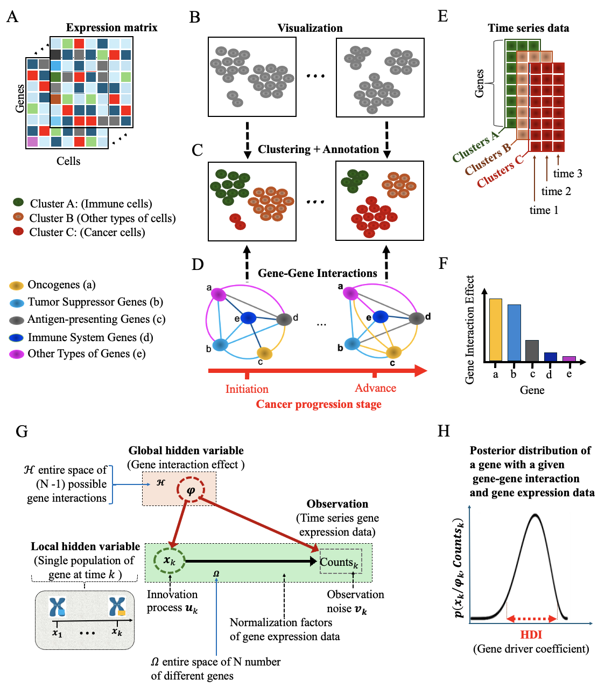

# PICDGI: Predict Immunosuppressive Cancer Driver Gene using gene-gene Interaction feature

$~~$

**Traditional frequency-based methods identify driver mutations by evaluating their recurrence across tumors, operating under the assumption that mutations occurring more frequently are functionally significant. However, these approaches often overlook rare driver mutations, particularly those with low mutation frequencies.**

**To overcome this limitation, we present PICDGI, a computational framework designed to predict cancer driver genes (CDGs) by leveraging single-cell RNA sequencing (scRNA-seq) data to model gene-gene interactions, thereby capturing cellular heterogeneity within tumors.**

**Unlike conventional methods, PICDGI utilizes variational Bayesian inference to model gene expression dynamics and quantify the influence of gene-gene interactions on tumor progression. It identifies CDGs by detecting their immunosuppressive effects on immune cells through interaction-driven mechanisms during cancer development.**

**Applied to LUAD scRNA-seq data, PICDGI identified top-ranked CDGs, with 62% overlapping known OGs and TSGs, while 38% are novel candidates. Compared to Moran’s I test in Monocle3, PICDGI-identified genes showed higher expression, reinforcing their role in tumor growth. By capturing gene expression dynamics and interactions, PICDGI offers insights into potential therapeutic targets for personalized cancer treatment.**

$~~$

# Overview to PICDGI framework

**A.** Processed scRNA-seq expression matrices from different cancer progression stages. 
**B.** Normalized and dimension-reduced scRNA-seq data for cell type identification. 
**C.** Annotated cell types, including immune cells, cancer cells, and others, for biological interpretation. 
**D.** Potential gene-gene interactions driving cancer evolution. The left and right plots depict interactions at early and advanced stages, respectively.  
**E.** Time-series gene expression data of cell types from cancer patients at three time points, capturing successive cancer progression stages. 
**F.** Gene Interaction Effects (GIE) contributing to genetic heterogeneity, reflecting statistical variability in interactions. 
**G.** Computational model linking time-series gene expression to local (gene mutation) and global (Gene Interaction Effect) hidden variables in cancer evolution. 
**H.** The effect of a gene on mutating another is quantified via the HDI of the posterior probability density function, considering gene-gene interactions and time-series gene expression. 

$~~$

# Steps in the PICDGI Framework for Identifying Cancer Driver Genes

**Step 1:** PICDGI calculates the average expression level of each gene across all cells within each cluster at different time points corresponding to the scRNA-seq data collection. This generates a pseudo-time-series gene expression dataset with dimensions N × T × C, where N represents the number of genes, T the number of time points, and C the number of clusters.

**Step 2:** PICDGI determines the cancer cell fraction within each cell to identify cancer progenitor cells using appropriate markers.

**Step 3:** PICDGI models gene mutation dynamics using a time-varying Autoregressive Moving Average (ARMA) process. 

**Step 4:** PICDGI applies Bayes' theorem along with variational Bayesian inference to estimate the probability density function that captures gene mutation dynamics during cancer progression, accounting for gene interactions.

**Step 5:** PICDGI calculates the gene driver coefficient as the highest density interval (HDI) of the posterior probability density function, which represents the range of the most probable true gene effects on other genes.

